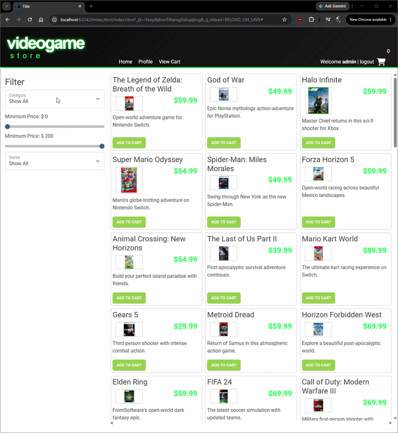
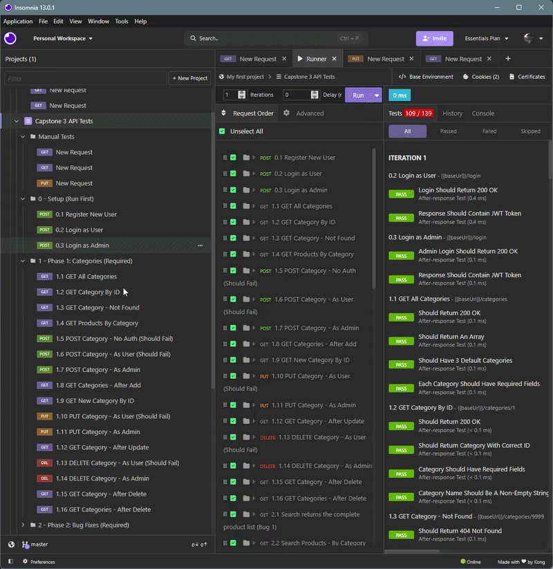

# Bogs Games

## Description of the Project

This project is a backend REST API for a video game store, built with Spring Boot and a MySQL database. It lets users browse products and 
add them to cart. The intended users are shoppers who want to browse and purchase video games and administrators who want to be able to
manage the store catalog. This applications main functionality is browsing products and being able to filter them to find things you want
specifically. It aims to solve the problem of managing an online store and making sure people have the required permissions to do certain
things.

## User Stories

- As a user, I want to be able to view all product categories, so that I can browse the store more easily
- As a user, I want to be able to view one category by ID, so that I can see details about a specific category
- As a user, I want to be able to view products in a category, so that I can browse related products
- As an admin, I want to be able to add a category, so that I can organize products into new groups
- As an admin, I want to be able to update a category, so that category names and descriptions stay current
- As an admin, I want to be able to delete a category, so that unused categories can be removed
- As a logged-in user, I want to be able to view my shopping cart, so that I can see what I plan to buy
- As a logged-in user, I want to be able to add a product to my cart, so that I can save items before checkout
- As a logged-in user, I want to be able to update a cart item's quantity, so that I can control how many of each product I want
- As a logged-in user, I want to be able to clear my shopping cart, so that I can remove all items at once

## Setup

Instructions on how to set up and run the project using IntelliJ IDEA.

### Prerequisites

- IntelliJ IDEA: Ensure you have IntelliJ IDEA installed, which you can download from [here](https://www.jetbrains.com/idea/download/).
- Java SDK: Make sure Java SDK is installed and configured in IntelliJ.
- MySQL

### Running the Application in IntelliJ

Follow these steps to get your application running within IntelliJ IDEA:

1. Set up the database by opening `database/create_database_videogamestore.sql` in MySQL Workbench and running it.
2. This project connects to the `easyshop` database by default. Set the `DB_NAME` environment variable to `videogamestore` in `application.properties`.
3. Open IntelliJ IDEA.
4. Select "Open" and navigate to the directory where you cloned or downloaded the project.
5. After the project opens, wait for IntelliJ to index the files and set up the project.
6. Find the main class `ECommerceApplication.java`, which contains the `public static void main(String[] args)` method.
7. Right-click on the file and select 'Run 'ECommerceApplication.main()'' to start the application. The API will be available at `http://localhost:8080`.

## Technologies Used

- Java: JDK 17
- Spring Boot
- MySQL

## Demo

### Front End Demo

### Insomnia Test

## Future Work

- Add ability for users to create and edit their profile
- Add check out feature
- Add admin control buttons to the front end
- Add ability to remove items 1 at a time from cart
- Add name search up feature

## Resources

- [Java Visual Learning Hub](https://raymaroun.github.io/yearup-java-visuals/index.html)
- [RayMaroun solution Repos](https://github.com/RayMaroun/yearup-spring-section-8-2026)
- [w3schools](https://www.w3schools.com/java/)
- [JSON PATH CheatSheet](https://github.com/json-path/JsonPath)

## Team Members

- **Bogdan Atamyeyev** - Developer

## Thanks

- Thank you to [Raymond Maroun] for continuous support and guidance.
- A special thanks to all my colleagues for their help.
 